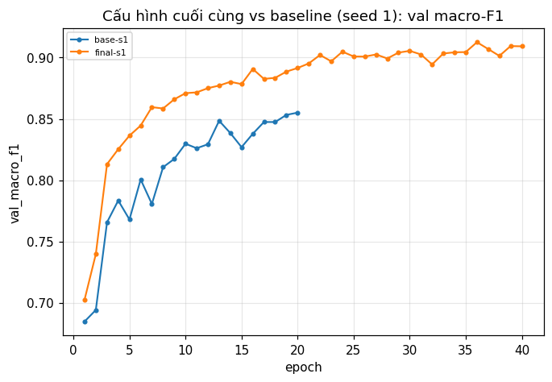

# Báo cáo Lab Day 1 — Ngô Đức Chung — 2A202602985

**Nguồn số liệu:** mọi con số trỏ về `exp_id` trong `experiments.xlsx`; các số không có cột trong bảng (`grad_norm`, tỉ lệ bước bị clip `clip_frac`, std kích hoạt `act_std_step0`, thời gian từng epoch) nằm trong `results/<exp_id>.json` (khoá `history`/`summary`) và output của `code/lab.ipynb`. Kết luận chỉ dựa trên **val**; eval chỉ dùng cho baseline và cấu hình cuối (mục 4). Δ tính so với trung bình baseline (val macro-F1 0.8577); "vượt nhiễu" nghĩa là |Δ| > 2σ = 0.0058.

## 1. Thiết lập

- **Môi trường:** MacBook Air (Apple Silicon), GPU `mps`, PyTorch 2.8.0, Python 3.9 (README yêu cầu 3.10+; code dùng `from __future__ import annotations` nên chạy được). Notebook chạy từ đầu đến cuối ~23 phút, không lỗi. Có nhánh `IN_COLAB` cho Colab nhưng **toàn bộ bài chỉ được chạy trên Mac, chưa chạy lại trên Colab/Kaggle** (đề yêu cầu Colab hoặc Kaggle; đây là một hạn chế).
- **Dữ liệu:** CoverType, `train` 464 809 / `eval` 116 203 theo `split_metadata.csv` (không sửa). Val = 20% train (phân tầng, seed 42): 371 847 train / 92 962 val. Chuẩn hoá 10 cột số bằng mean/std của train (val, eval chỉ được áp dụng).
- **Model:** `M-base` 54→256→128→7, ReLU, 47 879 tham số (có `assert`), softmax nằm trong loss. **Baseline:** CE, SGD+momentum 0.9, **lr 0.3** (chọn bằng val trong lưới 0.01–1.0), He, batch 512, 20 epoch, FP32, không dropout/clip. Mốc "đoán lớp đa số": accuracy val 0.4876.
- **Đã thử:** ☑ loss ☑ optimizer ☑ hyper-parameter ☑ dropout ☑ clipping ☑ mixed precision ☑ init (7/7).
- **Quy ước đo:** `train_loss` đo ở `eval()` trên 50 000 mẫu train cố định; `grad_norm` đo trước clip; epoch tốt nhất theo val loss; giữ batch cuối nhỏ hơn (dùng hết mọi mẫu).

## 2. Kiểm tra ban đầu và độ nhiễu

| Kiểm tra | Kết quả |
|---|---|
| Số tham số / shape logits | 47 879 / (B, 7) |
| Loss bước 0 (ln 7 = 1.946) | 2.378 (seed 42); 5 seed baseline: 2.12 ± 0.18 |
| Quá khớp 20 mẫu: loss cuối | 6·10⁻⁶, accuracy 100% (`figures/overfit20.png`) |
| Gradient mọi tham số khác 0 | có (norm 0.38–2.37) |
| Baseline, 5 seed (`base-s1..5`) | val macro-F1 **0.8577 ± 0.0029**, val acc 0.9126 ± 0.0026 |

**Ngưỡng nhiễu 2σ = 0.0058.** Loss bước 0 cao hơn ln 7 là hệ thống: He cho logit đầu ra độ lệch chuẩn ≈ 0.6 nên softmax không đều (ln 7 + σ²/2 ≈ 2.13); phép thử quá khớp đạt nên không phải lỗi code. **Đường cong baseline** (`figures/base-s1.png`): train/val loss giảm đều 0.44 → 0.20/0.22, khoảng cách val − train chỉ 0.023, best epoch 18–20 ở cả 5 seed, tức chưa quá khớp và vẫn đang học khi dừng.

## 3. Kết quả theo chủ đề

Mỗi thí nghiệm chạy một seed (seed 1); Δ nhỏ hơn 2σ chỉ là chưa kết luận được. Dự đoán trước nằm trong notebook (viết trước mỗi chủ đề).

**3.1 Loss (CE vs MSE)** — dự đoán MSE chậm và kém hơn CE. `loss-mse-lr0.3`: macro-F1 **0.782** (Δ −0.076, vượt 2σ); `loss-mse-lr1`: **0.628**. Cơ chế: `grad_norm` epoch 1 của MSE 0.056 so với CE 0.385 (nhỏ ~7 lần), vì CE có gradient `p − y` theo logit còn MSE `2(z − y)/7`. **Khác dự đoán:** tăng lr cho MSE lại tệ hơn (nguyên nhân chưa kiểm chứng). Không so loss CE với MSE trực tiếp (`compare_loss.png`).

**3.2 Bộ tối ưu** (mỗi bộ ≥ 3 lr cách ~3 lần; `compare_optimizer.png`, `compare_optimizer_adam_lr.png`):

| Bộ tối ưu | exp_id | lr | val macro-F1 |
|---|---|---|---|
| SGD thuần | `opt-sgd-lr1` | 1.0 | 0.8267 |
| SGD+momentum | `base-s1` | 0.3 | 0.8551 |
| AdamW (wd 0.01) | `opt-adamw-lr0.003` | 3e-3 | 0.8663 |
| **Adam** | `opt-adam-lr0.003` | 3e-3 | **0.8727** |

Adam hơn SGD+momentum +0.0150 (vượt 2σ); cơ chế phù hợp: Adam chuẩn hoá bước theo gradient từng tham số, hợp với đầu vào trộn cột liên tục và cột nhị phân thưa. SGD+momentum tăng đều tới lr 0.3 rồi **sập ở lr 1.0** (`hp-lr-sgdm-1`), Adam giảm êm ở hai phía. `opt-adamw-wd0-lr3e-3` trùng `opt-adam-lr0.003` tuyệt đối (đúng lý thuyết). **Sai dự đoán:** lr tốt nhất của SGD thuần chỉ gấp ~3.3 lần SGD+momentum (không phải ~10). **Hạn chế:** mọi Adam đều có best epoch = 20, xếp hạng có thể đổi nếu huấn luyện lâu hơn.

**3.3 Hyper-parameter** (`compare_hparam.png`, `compare_hparam_batch.png`):

| exp_id | Thay đổi | val macro-F1 | Δ | vượt 2σ |
|---|---|---|---|---|
| `hp-lr-sgdm-0.01/0.03/0.1` | lr | 0.766 / 0.818 / 0.851 | −0.092 / −0.040 / −0.007 | có |
| `hp-lr-sgdm-1` | lr 1.0 | 0.094 (sập) | −0.764 | có |
| `hp-batch128` | batch 128 | 0.800 | −0.058 | có |
| `hp-batch128-lr0.075` | batch 128, lr÷4 | 0.8576 | 0.000 | không |
| `hp-batch2048` | batch 2048 | 0.833 | −0.025 | có |
| `hp-batch2048-lr1.2` | batch 2048, lr×4 | 0.636 (sập) | −0.222 | có |
| `hp-wide` | M-wide 512-256 | 0.8779 | +0.020 | có |
| `hp-deep` | M-deep 256-128-64 | 0.8573 | 0.000 | không |
| `hp-wd5e-4` | weight decay 5e-4 | 0.709 | −0.149 | có |
| `hp-epochs40` | 40 epoch | **0.8809** | +0.023 | có |

Cùng 20 epoch nhưng batch 2048 chỉ có ~1/4 số bước nên chưa hội tụ (nhanh hơn 3 lần: 0.32 s/epoch). **Khác dự đoán:** batch 128 cùng lr 0.3 tệ hơn baseline (gradient nhiễu hơn, lr quá lớn), còn khi giảm lr ngang baseline thì mỗi epoch chậm gấp 3.4 lần; tăng lr theo lô (×4 = 1.2) làm sập; `M-deep` không giúp; weight decay 5e-4 làm xấu rất nhiều (nghi `lr·wd` kéo trọng số về 0 quá mạnh khi chưa quá khớp, chưa kiểm chứng). `M-wide` bắt đầu quá khớp nhẹ (best epoch 16, khoảng cách train–val 0.030).

**3.4 Dropout** (`compare_dropout.png`) — q = 0 / 0.1 / 0.3 / 0.5 cho macro-F1 **0.855 / 0.835 / 0.768 / 0.631** (đều vượt 2σ). Khoảng cách val − train thu hẹp (0.023 → 0.003) nhưng chỉ vì train loss (đo ở eval mode) tăng nhiều hơn val: mô hình chưa khớp hơn, không phải khớp tốt hơn. Đúng dự đoán: baseline chưa quá khớp nên dropout không có gì để chữa.

**3.5 Gradient clipping** (`compare_clipping.png`, `compare_clipping_gradnorm.png`) — `grad_norm` baseline trung bình 0.34–0.39 nhưng bước lớn nhất 2.95; chọn c = 0.35 (trung vị) để clipping kích hoạt thật (80% bước ở epoch 1, 46% ở epoch 20).

| exp_id | lr | clip | val macro-F1 | `grad_norm` lớn nhất |
|---|---|---|---|---|
| `clip-c0.35-lr0.3` | 0.3 | 0.35 | **0.8653** (Δ +0.0076, sát 2σ) | 2.95 |
| `hp-lr-sgdm-1` | 1.0 | không | 0.094 (sập) | 12.3 |
| `clip-c0.35-lr1` | 1.0 | 0.35 | **0.8166** (cứu được) | 2.95 |
| `clip-none-lr3` | 3.0 | không | 0.094 (sập) | 6 633 |
| `clip-c0.35-lr3` | 3.0 | 0.35 | 0.132 (**không** cứu được) | 4.30 |

**Khác dự đoán:** clipping còn cải thiện nhẹ ở lr baseline (giả thuyết chưa kiểm chứng: lr 0.3 sát ngưỡng sập, clipping cắt các gai gấp ~8 lần trung vị) và không cứu được lr 3.0 (bước hiệu dụng ≈ 3·0.35/(1−0.9) ≈ 10 vẫn quá lớn). Kết luận: clipping chặn gai gradient bất ngờ (lr 1.0) nhưng không thay được việc chọn lr.

**3.6 Mixed precision** (`compare_amp.png`) — FP32 **0.93 ± 0.03** s/epoch (5 seed); BF16 `amp-bf16` 1.08 s (+16%), macro-F1 0.8588; FP16 `amp-fp16` 1.34 s (+44%), 0.8576; chênh macro-F1 nằm trong 2σ. Đúng dự đoán: không nhanh hơn trên mạng nhỏ (chi phí ép kiểu và gọi kernel lớn hơn lợi ích). FP16 cần `GradScaler` vì khoảng giá trị hẹp (số chuẩn nhỏ nhất ≈ 6·10⁻⁵) làm gradient nhỏ bị flush về 0; BF16 có số mũ 8 bit như FP32 nên không cần. **Hạn chế:** chỉ MPS, mạng nhỏ; `peak_mem_MB` trên MPS là bộ nhớ đang cấp phát cuối epoch (không phải đỉnh), bị chi phối bởi dữ liệu FP32 nên không dùng để kết luận về bộ nhớ.

**3.7 Khởi tạo** (`compare_init.png`; std kích hoạt sau Linear 1/2/3 ở bước 0):

| exp_id | std kích hoạt | loss bước 0 | val acc | val macro-F1 |
|---|---|---|---|---|
| `base-s1` (He) | 0.671 / 0.649 / 0.588 | 2.269 | 0.9113 | 0.8551 |
| `init-zeros` | 0 / 0 / 0 | 1.946 | **0.4876** | **0.0936** |
| `init-normal` | 0.035 / 0.004 / ≈ 0 | 1.946 | 0.9142 | 0.8649 |
| `init-xavier` | 0.280 / 0.221 / 0.195 | 2.022 | 0.9130 | 0.8610 |
| `init-default` | 0.278 / 0.115 / 0.060 | 1.983 | 0.9143 | 0.8674 |

`zeros` hỏng đúng cơ chế: accuracy/macro-F1 bằng đúng mốc đoán lớp đa số, best val loss 1.2053 ≈ entropy phân bố lớp (1.2052). Khi W = 0 thì h₁ = ReLU(0) = 0 nên gradient của W₂, W₃ (∝ hᵀ) và W₁ (qua W₂ᵀ) đều bằng 0; chỉ bias lớp ra học được, và các nơ-ron cùng lớp luôn đối xứng. He giữ std kích hoạt qua các lớp (`Var = 2/n_in`), Xavier co dần, `normal(0.01)` co ~10 lần mỗi lớp. **Khác dự đoán:** `normal` vẫn học tốt (vượt 2σ) và He không hơn default (+0.0097, vượt 2σ) hay Xavier (+0.0033, trong nhiễu); có thể do lr 0.3 được chọn riêng cho He (confound chưa tách).

## 4. Đánh giá cuối trên tập eval

**Chọn bằng val:** gộp các thay đổi vượt nhiễu của Part 3 (Adam lr 3e-3, `M-wide`, 40 epoch). Ba ứng viên (seed 1, nhóm `other`): `cand-adam-wide` 0.8826, `cand-adam-ep40` 0.8950, **`cand-adam-wide-ep40` 0.9092** → chọn **Adam, lr 3e-3, 54-512-256-7 (161 287 tham số), 40 epoch**, chạy 5 seed (`final-s1..5`). Cấu hình này khác baseline ở ba yếu tố nên "cải thiện" là của cả gói (cộng dồn dưới mức tuyến tính: +0.0249 và +0.0373 riêng lẻ, +0.0515 gộp).

| Cấu hình | val macro-F1 | **eval macro-F1** | eval accuracy |
|---|---|---|---|
| Baseline (5 seed, TB ± σ) | 0.8577 ± 0.0029 | 0.8585 ± 0.0040 | 0.9108 ± 0.0027 |
| Cấu hình cuối (5 seed, TB ± σ) | 0.9086 ± 0.0006 | 0.9075 ± 0.0021 | 0.9394 ± 0.0013 |
| **File nộp `final-s1`** (seed chọn trước khi xem eval) | 0.9092 | **0.9065** | **0.9402** |

Cải thiện eval macro-F1 **+0.0490**, lớn hơn 2σ_eval của baseline (0.0079); val (+0.0509) và eval nhất quán, val ≈ eval nên không có dấu hiệu lệch do chọn bằng val. `evaluate.py` chỉ chạy cho baseline và cấu hình cuối (10 file, 5 mỗi bên).

### 4.1 Phân tích lỗi theo lớp (`final-s1`; `eval_result.json`, `figures/confusion_final.png`)

| Lớp | support | precision | recall | F1 |
|---|---|---|---|---|
| 0 Spruce/Fir | 42 368 | 0.956 | 0.918 | 0.936 |
| 1 Lodgepole | 56 661 | 0.938 | 0.961 | 0.949 |
| 2 Ponderosa | 7 151 | 0.948 | 0.936 | 0.942 |
| 3 Cottonwood/Willow | 549 | 0.862 | 0.807 | **0.834** |
| 4 Aspen | 1 899 | **0.787** | 0.895 | 0.838 |
| 5 Douglas-fir | 3 473 | 0.881 | 0.915 | 0.897 |
| 6 Krummholz | 4 102 | 0.945 | 0.953 | 0.949 |

**Lớp khó nhất: lớp 3 (F1 0.834)**, rồi lớp 4 (0.838). Lớp 3 chỉ có 549 mẫu eval (0.47%) nên vài chục lỗi đã kéo recall xuống 0.807; nó hay bị nhầm sang lớp 2 (69 mẫu = 12.6% support) và lớp 5 (37 mẫu). Lớp 4 có precision thấp nhất: 370 mẫu thật là lớp 1 bị đoán thành lớp 4. Về số tuyệt đối nhầm nhiều nhất là 0 ↔ 1 (3 230 và 1 602 mẫu) nhưng support lớn nên F1 vẫn cao. Lý giải: số mẫu ít (lớp 3, 4) và đặc trưng chồng lấn giữa các cặp hay nhầm (phần chồng lấn là **giả thuyết chưa kiểm chứng**); macro-F1 (0.9065) thấp hơn accuracy (0.9402) vì lớp hiếm kéo xuống. **Sẽ thử:** CE có trọng số lớp/lấy mẫu lại cho lớp 3, 4; huấn luyện lâu hơn (best epoch là 40 ở 3/5 seed); mạng rộng hơn.

## 5. Câu hỏi dẫn dắt

1. **Bộ tối ưu nào thắng khi chỉnh lr công bằng?** Adam (lr 3e-3) 0.8727 > SGD+momentum 0.8551 (+0.015, vượt 2σ) > SGD thuần 0.8267. Nếu không chỉnh lr thì kết luận đảo được: Adam ở lr 3e-4 chỉ 0.785 và SGD+momentum ở lr 0.01 chỉ 0.766, đều thua lr tốt nhất của bộ kia (mục 3.2, 3.3).
2. **Dropout có giúp khi chưa quá khớp?** Không (0.835 / 0.768 / 0.631 với q = 0.1 / 0.3 / 0.5); dùng khi train thấp mà val tăng dần (mục 3.4).
3. **Clipping giải quyết gì?** Chặn gai gradient để lr cao không làm sập: ở lr 1.0 không clip sập (0.094, `grad_norm` lớn nhất 12.3), có clip 0.817; không cứu được lr 3.0 (mục 3.5).
4. **Mixed precision có nhanh hơn?** Không trên mạng nhỏ và MPS này (FP32 0.93, BF16 1.08, FP16 1.34 s/epoch), độ chính xác không đổi (mục 3.6).
5. **Vì sao `zeros` hỏng; He khác Xavier?** Gradient các lớp trước bằng 0 vì ReLU(0) = 0 và các nơ-ron đối xứng, nên mạng chỉ còn bias lớp ra (accuracy 0.4876). He dùng `2/n_in` (bù ReLU triệt một nửa) nên giữ std qua các lớp, Xavier `2/(n_in + n_out)` co dần; khác biệt chỉ quan trọng với mạng sâu, ở mạng 3 lớp He không hơn Xavier (mục 3.7).
6. **Loss không giảm sau 2 000 bước — 3 phép kiểm tra đầu tiên:** (a) loss bước 0 ≈ ln 7 (khởi tạo/chuẩn hoá); (b) quá khớp 20 mẫu với mọi chính quy hoá tắt (nếu không về ≈ 0 thì gần như chắc là lỗi code: nhãn, softmax hai lần, quên `zero_grad`); (c) mọi tham số có gradient khác 0, kèm ghi train/val loss và `grad_norm`. Loss phẳng quanh entropy lớp 1.205 (`init-zeros`, `hp-lr-sgdm-1`, `clip-none-lr3`) là mạng chỉ đoán lớp đa số; `grad_norm` lên 6 633 cho thấy lr quá cao.

## 6. Hạn chế và điều bất ngờ

- **Một seed cho phần lớn thí nghiệm** (chỉ baseline và cấu hình cuối có 5 seed); σ ước lượng từ 5 seed còn thô. Δ nhỏ hơn 2σ (`hp-deep`, `amp-*`, `hp-batch128-lr0.075`) chỉ là chưa kết luận được.
- **Lưới lr thô** (cách ~3 lần) và **lr baseline chỉ được chọn cho He**, nên so sánh init và loss có confound; baseline 20 epoch chưa hội tụ (best epoch ≈ 20) nên xếp hạng có thể đổi nếu huấn luyện lâu hơn.
- **Bất ngờ so với dự đoán:** MSE ở lr cao tệ hơn; batch 128 cùng lr tệ hơn; `M-deep` không giúp; wd 5e-4 làm xấu rất nhiều; clipping cải thiện ở lr baseline nhưng không cứu được lr 3.0; `normal(0.01)` học tốt và He không hơn default. Mọi giải thích cho các điểm này là giả thuyết chưa kiểm chứng (đã ghi ở từng mục).
- **Quy trình:** lưới lr và ba lựa chọn cho cấu hình cuối được định hướng sau một lần quét thăm dò trên **val** (không dùng eval); vài dự đoán (optimizer, clipping, amp) viết sau khi đã thấy sơ bộ kết quả quét lr hoặc thử môi trường, và đã ghi chú trong notebook. Hai lần chạy notebook cho các chỉ số tóm tắt trùng khớp tuyệt đối ở 42 thí nghiệm được so sánh (seed cố định).
- **Khác:** `experiments.xlsx` giữ công thức của mẫu (cột `beyond_noise`, Seeds, Summary); mở bằng Excel/Numbers để chúng tự tính lại. Sau này nên chọn lr riêng cho từng init, thử CE có trọng số lớp, huấn luyện > 40 epoch và chạy nhiều seed cho các Δ sát ngưỡng (`clip-c0.35-lr0.3`, `init-default`).

## 7. Phụ lục

- **File nộp:** `REPORT.md`, `experiments.xlsx` (50 dòng), `predictions_eval.csv`, `eval_result.json`, `figures/` (50 ảnh `<exp_id>.png`, 13 ảnh `compare_*.png`, `confusion_final.png`, `overfit20.png`), `results/` (50 file `<exp_id>.json`), `code/` (`lab.ipynb`, `data.py`, `model.py`, `optimizer.py`, `train.py`, `plots.py`, `results_table.py`, `requirements.txt`).
- **Thời gian chạy:** toàn bộ notebook ≈ 23 phút trên GPU MPS của MacBook Air (~1 s/epoch với baseline).
